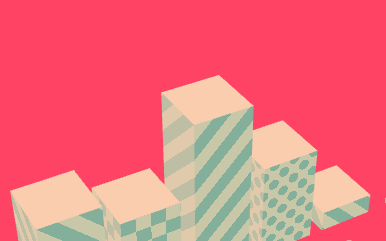

# ChartGL

A chart experiment in React + WebGL + CSS3D. [See online demo](https://chartgl.zone) (https://chartgl.zone).

## Thanks

- ReGL (WebGL helper): http://regl.party/
- glMatrix (math): http://glmatrix.net/
- onecolor (RGB conversion): https://github.com/One-com/one-color
- ColourLovers palettes extracted by [@mattdesl](https://twitter.com/mattdesl): https://github.com/Jam3/nice-color-palettes
- React Motion (animation): https://github.com/chenglou/react-motion
- Howler (sound): https://howlerjs.com/
- Leshy SFMaker (sfx): https://www.leshylabs.com/apps/sfMaker/
- Mockaroo (chart labels): http://www.mockaroo.com/
- [Surge](https://surge.sh/) (hosting)
